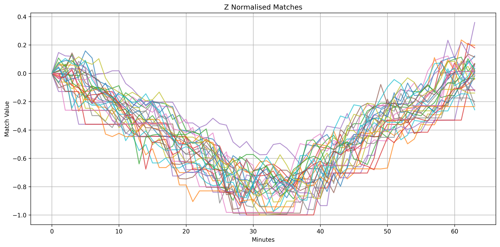
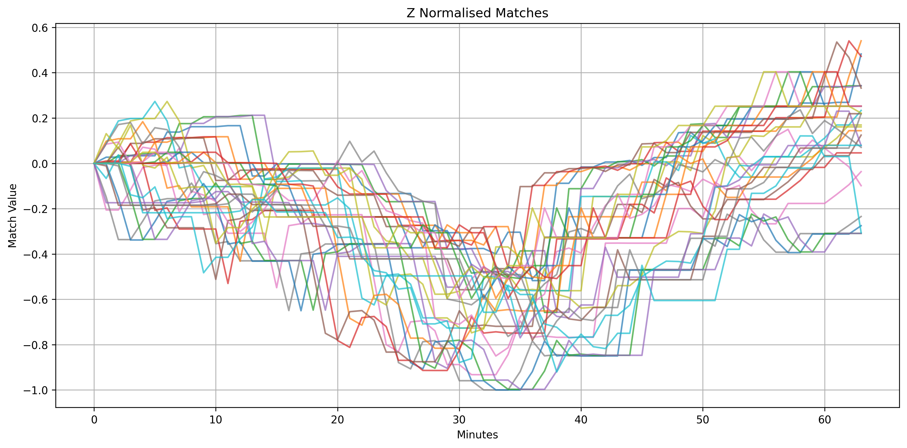

# Effective TSS on a Partitioned Database

TSS (Temporal Similarity Search) is a technique used to find patterns in time series data by comparing a query pattern to a longer series. It’s useful when you want to identify where a particular shape or trend (like a spike, dip, or repeated structure) occurs in your data — such as finding similar price movements, temperature trends, or signal patterns.

This tutorial walks through the process of creating a partitioned database filled with BTC data. It then demonstrates how to conduct TSS efficiently across partitions, accounting for matches that may occur over across partition borders.

## 1. Prerequisites

1. Requires KDB-X to be installed, you can sign up at https://developer.kx.com/products/kdb-x/install.
2. Ensure you have the necessary dataset:
   1. Download the Bitcoin sample dataset from Kaggle: [Cryptocurrency Timeseries 2020](https://www.kaggle.com/api/v1/datasets/download/roopahegde/cryptocurrency-timeseries-2020)
   2. Extract `archive.zip` into the same directory where you are running this from. Three files will be returned, but we're only going to be using `gemini_BTCUSD_2020_1min.csv`, which should be available in this directory.

## 2. Loading and Preparing the Data

Launch a q session and load the ai-libs initialization script:
```q
.ai:use`kx.ai
```

Load the datasets into a table in memory, first we read in three 1-minute resolution crypto datasets for BTC, ETH, and LTC:

```q
tab:(" *SFFFFF";enlist ",") 0: `$":gemini_BTCUSD_2020_1min.csv";
tab,:(" *SFFFFF";enlist ",") 0: `$":gemini_ETHUSD_2020_1min.csv";
tab,:(" *SFFFFF";enlist ",") 0: `$":gemini_LTCUSD_2020_1min.csv";
```
Next, we parse and clean the time column the reorder the columns and sort the table ascending by time:

```q
time:sum@/:(("D";"N")$'/:" " vs/: tab`Date);
tab:`time xcols update time:time from delete Date from tab;
tab:`time xasc `time`sym`open`high`low`close`volume xcol tab;
```

Then save the data to disk partitioned on date:

```q
dts:asc exec distinct `date$time from tab;
{[dt;t]
    (hsym `$"cryptodb/",string[dt],"/trade/") set .Q.en[`:cryptodb] `time xasc select from t where dt=`date$time;
    }[;tab] each dts;
.Q.chk[`:cryptodb];
delete tab from `.;
.Q.gc[];
```

In the above we:
- Partitions your full timeseries dataset by date
- Saves each partition as a subdirectory under cryptodb/, e.g., cryptodb/2020.01.01/trade/
- Validates the result and frees up memory

This is a common pattern for managing large timeseries data efficiently, enabling fast, date-based querying and I/O performance.

Next, we load the on-disk data into our process without changing directory using:

```q
.Q.lo[`:cryptodb;0;0];
```

And to get an idea of the type of data we're working with we inspect the first record:

```q
first select from trade where date=first date, i=0
```
    date  | 2020.01.01
    time  | 2020.01.01D00:00:00.000000000
    sym   | `sym$`BTCUSD
    open  | 7165.9
    high  | 7170.79
    low   | 7163.3
    close | 7163.3
    volume| 0.00793095

The first record from the Kaggle: Cryptocurrency Timeseries 2020 dataset shows a 1-minute snapshot of BTC/USD trading on January 1st, 2020, including the timestamp, price range (open, high, low, close), and traded volume.

Now that we understand the structure of the data, we can move on to efficiently querying using TSS.

## 3. Performing TSS Searches

Now, we create a V-shaped float vector which we will use as our pattern we wish to find matches of. We choose a pattern length of 64 arbitrarily here, feel free to experiment with your own query vectors.

```q
q:abs neg[32]+til 64;
k:10000;
```
In the above:
- `64?1f` generates 64 random float numbers between 0 and 1 
- `neg[32]` returns -32
- `abs` tables the absolute value of the line

The result is a random pattern that fluctuates around zero, mimicking price fluctuations that we may want to detect in the time-series data.

There are two different use cases on partitioned databases:
1. **Patterns without Overlap** 

    For non-continuous data like NSYE market data, you only care about patterns within a single partition (e.g., within a single day). Here, you avoid searching across partition boundaries and focus on data within each partition.
2.  **Patterns with Overlap** 

    For time-series data like BTCUSD, data is partitioned by time (e.g., by day). You may want to find patterns that span across multiple partitions (e.g., a pattern from 2021-01-01 continuing into 2021-01-02). In this case, searches need to account for the overlap between partitions.

We show below a memory-efficient and parralelisable approach for partitioned databases, which can be applied to filtered searches as well.

### Example Query: Partition Optimised

This solution has two steps:

#### 1. Without Overlap

First we do a tss search by date using `.ai.tss.tss`, and then the relevant record is joined back to the starting point of the match using the IDs returned from the search. Here's the core query:

```q
t:select {a:.ai.tss.tss[x;q;k;`ignoreErrors`returnMatches!11b];a@\:iasc a[1]} close by date from trade where sym = `BTCUSD;
```
Then, the result is processed to match relevant data, like so:
```q
res:select from trade where sym=`BTCUSD, {[x;y;z] a:x[z;`close;1]; $[all null a;y#0b;@[y#0b;a;:;1b]]}[t;count i;first date];
```
The data is then flattened using `ungroup`, two new columns `dist` and `match` added populated with the distances and the matching values from the search. Finally the data is filtered to only retrieves the rows with the smallest `dist values`, which are considered the best matches.
```q
d:(0!t)`close;
res:res,' ungroup ([] dist:d[;0]; match:d[;2]);
res:`dist xasc select from res where i in k#iasc dist;
```
    date       time                          sym    open     high     low      close    volume      dist     match       ..
    ---------------------------------------------------------------------------------------------------------------------..
    2020.12.08 2020.12.08D12:11:00.000000000 BTCUSD 18842.04 18842.04 18841.2  18841.2  0.05202422  2.227005 18841.2  188..
    2021.01.28 2021.01.28D20:14:00.000000000 BTCUSD 32925    32961.79 32925    32956.85 6.052956    2.298247 32956.85 329..
    2020.12.08 2020.12.08D12:10:00.000000000 BTCUSD 18848.79 18848.79 18841.29 18842.04 0.1091669   2.319017 18842.04 188..
    2020.11.04 2020.11.04D02:13:00.000000000 BTCUSD 13857.96 13891.4  13857.96 13891.4  0.4292499   2.341793 13891.4  138..
    2020.02.23 2020.02.23D21:33:00.000000000 BTCUSD 9905.39  9905.39  9905.39  9905.39  0           2.353222 9905.39  990..
    2020.02.23 2020.02.23D21:34:00.000000000 BTCUSD 9905.39  9905.39  9902.59  9902.66  0.08768819  2.437255 9902.66  990..
    2020.12.08 2020.12.08D12:12:00.000000000 BTCUSD 18841.2  18841.2  18840    18840    0.01363459  2.4405   18840    188..
    2021.01.13 2021.01.13D09:19:00.000000000 BTCUSD 34930.64 34987.76 34930.64 34987.76 0.001133045 2.45972  34987.76 350..
    2021.01.28 2021.01.28D20:13:00.000000000 BTCUSD 32908.97 32925    32882.39 32925    7.625257    2.470088 32925    329..
    2021.01.28 2021.01.28D20:15:00.000000000 BTCUSD 32956.85 32976.23 32949.08 32949.09 11.53418    2.470146 32949.09 329..





#### 2. With Overlap

Now we search across the overlap of dates:

```q
ovl:(0N;2*count[q])#count[q]_select from trade where sym=`BTCUSD, (i in count[q]#i) | (i in neg[count[q]]#i);
ovltss:.ai.tss.tss[;q;k;`ignoreErrors`returnMatches!11b] each ovl[;`close];
```

In the above:
- `ovl` handles data that might span across the partition boundaries by focusing on the indices that exist in both partitions. The code builds an overlap list  and ensures that only the overlapping data from the partitions is used in the subsequent time series search.
- `ovltss` then performs `tss` for each of the overlapping partitions, ensuring that the relevant matching records (in this case, the close prices) are identified, even if they span across different partitions.

And finally we consolidate the two searches starting by filtering the `ovltss` results to keep only those where the values are less than the maximum value of the `dist` column (`maxTopK`). Then we consolidate the better matches from the previous step with the overlap data (`ovl`).

```q
maxTopK:max res`dist;
better:where@'ovltss[;0]<maxTopK;
betterOverlap:raze ovl@'ovltss[;1]@'better;
```
Next we extract the match data and the distance data and consolidate them into two separate lists, `match` and `dist`. Then we create a new table called `betterOverlapFull`, which combines the `betterOverlap` data with the `dist` and `match` data into a single table.

```q
match:raze ovltss[;2]@'better;
dist:raze ovltss[;0]@'better;
betterOverlapFull:betterOverlap,'([] dist:dist; match:match);
```



This process above is designed to refine the results, ensuring that only the best matches (those with lower distances) are kept, and all relevant information is combined into one final table, which is then sorted for the final output `res` that contains the top k closest matches sorted by distance:

```q
res:k#`dist xasc res,betterOverlapFull;
```


## Conclusion

This tutorial demonstrated how to:
- Efficiently load and process data from CSV files into a time series database.
- Perform advanced time series searches to identify specified patterns of interest, focusing on cryptocurrency price movements.
- Optimize and conduct TSS operations across partitioned databases to ensure scalable and high-performance querying.
