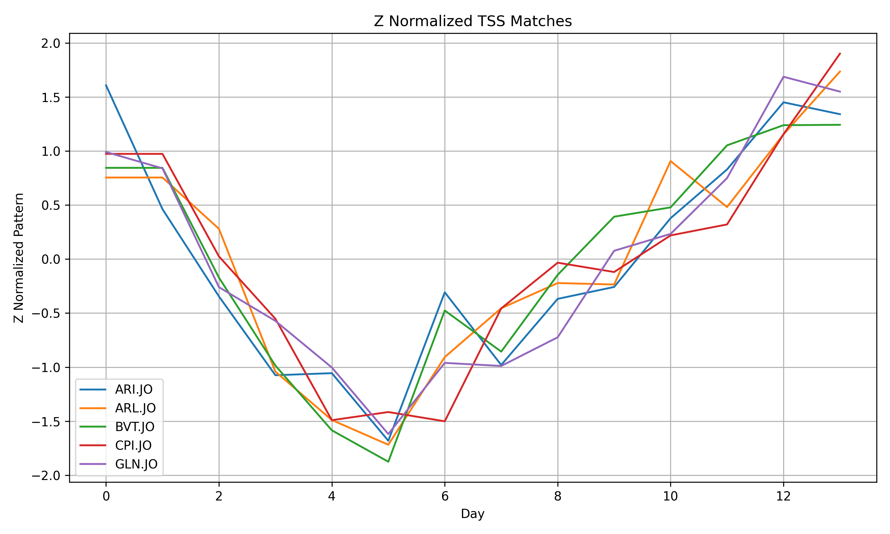
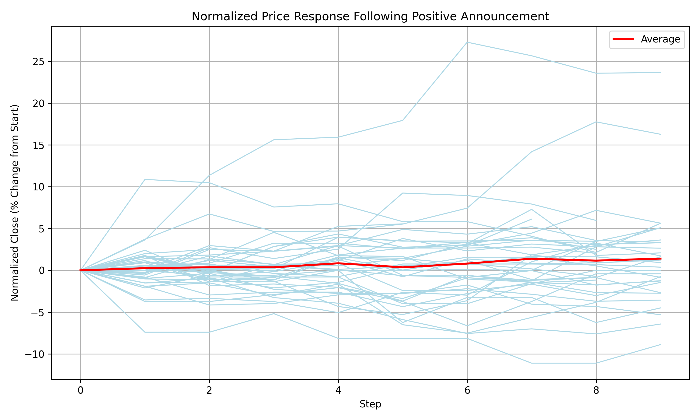

# Combining Structured and Unstructured Data

> **Note**: This tutorial is part of a beta release of software that is not yet publicly available. Please contact KX for access.
> 
This tutorial walks through the process of converting CSV data to KDB-X tables, and using Python to fetch Yahoo Finance ticker information. It then demonstrates the process of creating embeddings on CPUs leveraging Python under KDB-X to bring the neural networks from PyTorch to our data. After preparing the data, multiple strategies are explored to extract insights from both the structured and unstructured data, utilising the ai-libs' TSS (Temporal Similarity Search) for timeseries patterns, and HNSW (Hierarchical Navigable Small World) index for textual data.

## 1. Prerequisites

1. Requires KDB-X to be installed, you can follow the installation guide at https://kx.com/products.
2. Ensure you have the necessary dataset:
   1. Download the dataset from Kaggle: [JSE SENS Announcements](https://www.kaggle.com/api/v1/datasets/download/katendencies/jse-sens-announcements)
   2. Extract `archive.zip` into the same directory where you are running this from. The file `SENS_Announcements.csv` should be available in this directory.
2. Ensure KDB-X Python (`pykx`) is installed:
    ```bash
    pip install --pre pykx
    ```
3. Install requirements.txt
    ```bash
    pip install -r requirements.txt
    ```


## 2. Using Python for Text Embeddings and Data Retreival

In this section, we prepare the environment to generate sentence embeddings in q using Python under KDB-X, which lets us run Python code from within a q session. We'll use a lightweight transformer model (MiniLM) via the sentence-transformers Python library, and apply dynamic quantization to improve performance. This setup allows us to convert text into numerical vectors — a key step for downstream tasks like semantic search or clustering.

We also configure PyTorch for efficient parallelism and prepare a mock HTTP session for later use with yfinance, which we'll use to fetch financial data.

Start by launching a q session.

> Note: To take advantage of parallel execution, you must start your process with secondary threads enabled. You can do this using the -s command-line flag when launching the process e.g. `q -s 4`

Next you will need to make sure [Python under KDB-X](https://code.kx.com/pykx/pykx-under-q/intro.html#prerequisites) is installed by running:

```q
system"python -c \"import pykx;pykx.install_into_QHOME(to_local_folder='",(.z.v`QHOME),"')\""
```

Then load the ai-libs initialization script and python.q file, we turn off warnings to reduce the amount of information sent to the console.

```q
system"l ",getenv[`HOME],"/.kx/ai-libs/init.q"
\l pykx.q
.pykx.pyexec"import warnings";
.pykx.pyexec"warnings.simplefilter(\"ignore\")";
```

Now, via Python we can easily import PyTorch, load the sentence transformer class and import the dynamic quantization utility. For optimal parallelisation we can set our PyTorch threads to number of secondary threads minus one (e.g. `4-1=3` in our case).

```q
torch:.pykx.import`torch;
ST:.pykx.import[`sentence_transformers;`:SentenceTransformer];
qd:.pykx.import[`torch.quantization;`:quantize_dynamic];
qconf:.pykx.import[`torch.quantization;`:default_qconfig];
torch[`:set_num_threads][3];
```
Next, we load a lightweight transformer model (MiniLM), and apply dynamic quantization to improve performance. The embed function wraps the model's encode method, so you can pass in strings from q and get back embeddings.
```q
model:ST[`$"paraphrase-MiniLM-L3-v2";`device pykw `cpu];
tqint8:torch[`:qint8];
qmodel:qd[model;.pykx.eval["lambda x: {x}"] torch[`:nn.Linear];`dtype pykw tqint8];
embed:{x[`:encode][y]`}[qmodel;];
```

Relevant KDB-X Python concepts used in the above include:
- [Accessing attributes](#https://code.kx.com/pykx/pykx-under-q/intro.html#get-attributes-and-properties): Get attributes and properties
- [Calling Python methods from q](#https://code.kx.com/pykx/pykx-under-q/intro.html#function-calls): Function calls
- [Running inline Python code from q](#https://code.kx.com/pykx/pykx-under-q/intro.html#evaluate-and-execute-python): Evaluate and execute Python


We now have a function `embed` that takes in a Python string (q symbol) and returns an embedding.

```q
embed `$"Hello World!"
```
    0.04248363 0.0840219 0.3799664 0.01081513 0.127..

We also set up `yfinance` for later, we will use `curl_cffi` as our session so we can avoid rate limiting.

```q
yf:.pykx.import`$"yfinance";
curl:.pykx.import`$"curl_cffi";
req:curl`:requests;
session:req[`:Session][`impersonate pykw `chrome];
```

With this setup complete, we now have a fast, callable embedding function (`embed`) in q, and a Python session ready to fetch external data when needed.

## 3. Loading and Preparing the Data

First we load in our SENS announcements.

```q
file:`$":SENS_Announcements.csv";
locs:where like[;"*\"*"] each text:read0 file;
blocks:(0N;2)#locs;
sens:("P S SSS S*";enlist ",") 0: enlist[first text],{[x;y] raze x[y[0]+til 1+y[1]-y[0]] }[text]'[blocks];
sens:`time`sym`isin`company`sector`headline`body xcol sens;
range:(2017.03.01;2017.11.01);
sens:`time xasc select from sens where time within range;
```

In the above, we stitch together our CSV records since `read0` interprets newlines literally, and then we parse with `0:` to convert the CSV to a table. We then filter on time to a period of interest.

Here’s an example of the first record (`first sens`), with a breakdown of each field:

    time    | 2017.03.01D07:05:00.000000000
    sym     | `PFG.JO
    isin    | `ZAE000118279
    company | `Pioneer Foods Group Ltd
    sector  | `Consumer, Non-cyclical
    headline| `dealings security by director
    body    | "PFG 201703010001ADealing In Securities By A DirectorPioneer Food Group LimitedIncorporated in the Republic of South AfricaRegistration number: 1996/017676/06Share code: PFG..

Each row in the sens table represents a distinct SENS announcement made by a company. It includes key information like the timestamp, company ticker symbol, sector, headline, and the full text of the announcement. This structure allows us to analyze the content of the announcements and link them to market data for further processing, such as generating embeddings for text analysis.

Now we retrieve the corresponding market data via yfinance.

```q
yfdts:ssr[;".";"-"] each string range;
```
We create a date range for querying market data from Yahoo Finance.
```q
pullForTicker:{[sym;yf;dts] tickerData:yf[`:Ticker][sym; `session pykw session];res:tickerData[`:history][pykwargs`start`end!`$(dts[0];dts[1])]`;if[not count res;:()];update sym:sym from 0!res}[;yf;yfdts];

trades:raze pullForTicker each exec distinct sym from sens;
trades:`time`sym xcols `time`open`high`low`close`volume`sym xcol ![trades;();0b;`$("Dividends";"Stock Splits")];
```

This goes through each of the provided yfinance tickers as provided in the SENS announcements, and attempts to retrieve financial data for the date range supplied. We then rename our columns, and drop the columns we won't be using via a functional delete.

Now, since some of the tickers provided in the SENS announcements weren't retrieved, we filter down to only the syms we have corresponding market data for.

```q
sens:select from sens where sym in exec distinct sym from trades;
```

We now use our `embed` function defined in Section 2 above to generate embeddings for the body of the SENS announcements. We use a very naive chunking strategy for this example, just splitting the body into 1000 characters chunks without overlap.

```q
sens:update body:`$(0N;1000)#/:body from sens;
sens:update body:string body from ungroup sens;
sens:update body:{x[]where x in (.Q.an," ,.")}each body from sens;

sens:update embedding:embed[`$body] from sens;
```
>Note: The time to execute the above step when creating the embeddings can vary, it may take up to a few minutes depending on your machine capabilites and secondary threads set.

And finally, to enable efficient similarity searches later, we insert the embeddings into a HNSW (Hierarchical Navigable Small World) index:

```q
hnsw:.ai.hnsw.put[();();exec embedding from sens;`L2;32;::;64];
```

## 4. Exploring the Data

In this section we explore our data from a few different perspectives. In Section 1, we start with a particular search phrase, and identify if this is a leading indicator for market movements. In the second section, we instead start from a financial timeseries pattern of interest and look for any SENS announcements made surrounding the pattern to identify any causal relationships between the announcements released and the associated market movement. Finally, in section three, we attempt to see if the relationship theorised in Section 2 is a common pattern, or an edge case. We do this by looking for when a timeseries pattern overlaps with a SENS announcment similar to __"Headline earnings per share up, Headline earnings up"__, within a given buffer, and analyse the market movements following these criteria.

> **Note**: These examples are focused on providing the user familiarity with combining structured and unstructured data using the ai-libs, and less focused on a rigorous financial analysis of the data at hand, some liberties are taken.

### 4.1 Unstructured Based Search

Lets search for a term that indicates some form of results being published, such as "interim results".

```q
q:embed[`$"interim results"]; 
res:.ai.hnsw.search[exec embedding from sens;hnsw;q;30;`L2;256];
search:sens@res[1];
```

We then retrieve the normalized stock movement in the 14 days proceeding the announcement.

```q
f:`sym`time;
w:(1D 14D)+\:search.time
searchTrades:`close xcols wj[w;f;search;(trades;({%[last[x]-first[x];first[x]]};`close))]
```

The following is a graph of these movements, based around zero, and aligned in time where zero is the time of announcement. We have drawn the line of the average response in red.


In the results we retrieved over the timespan of our dataset, it appears that the average response was positive, with an average percentage stock price increase over 14 days of 3.8%.

```q
avg searchTrades`close
```
    0.03899129

Future analysis could be done according to the spread and volatility.

### 4.2. TSS Based Search joined back on Unstructured Data 

Now lets search for a particular pattern, a market dip then recovery. We will construct a query pattern that falls over 5 days, then recovers back over the next 10 days.

```q
avgLeg:{x%max x};
downleg:neg avgLeg til 5;
upleg:1_neg[1]+avgLeg til 10;
v:downleg,upleg;
```

After creating our query vector, we use TSS to search by sym across our trades data.

```q
k:5;
t1:select {a:.ai.tss.tss[x;v;1;`ignoreErrors`returnMatches!11b];a@\:iasc a[1]} close by sym from trades;
res:raze {select from trades where sym = x[`sym], i in i@x[`close;1] } each 0!t1;
d:(0!t1)`close;
res:res,'([] dist:d[;0]; match:d[;2]);
res:`dist xasc select from res where i in k#iasc dist;
```

If we plot the z-normalized matches, we see we have found our V pattern



Now let's see what SENS Announcements were made surrounding our matches.

```q
sens1:raze {select from sens where sym = x[`sym], time within x[`time] + -5D 15D}'[res];
string distinct sens1`headline
```
    "dealings security by director"
    "unaudited result"
    "quarterly disclosure term regulation 43 regulation relate bank"
    "general repurchase 4. 89 % non - redeemable non - cumulative non - participate preference share"
    "interim result"
    "gln \342\200\223 director declaration"
    "gln \342\200\223 glencore hna establish hg storage international ltd."

Let's investigate the unaudited result

```q
unaudited:select from sens1 where headline=`$"unaudited result", sym=first sym;
```

Reading through the text we find:

> Headline earnings per share up 17% to 1 769 cents
> Headline earnings up 17% to R2.046 billion
> Return on equity: 26%

Which is very positive. If we contextualise this in time with our timeseries pattern we searched, we see that the uptick in stock price aligns exactly with when this announcement was made.


## 4.3 Combining TSS and HNSW Searches

Extrapolating from the previous example, we could hypothesise that downwards stock movements followed by a positive earnings announcement leads to a full recovery within two weeks of the stock price to the point it was 5 days prior to the announcment. To quickly backtest this, we can look for just a down leg preceeding a similarity search result on positive earnings information, to see if in other situations similar to our previous example, the same stock response is observed.

First create the distance profile for the down leg.

```q
distanceProfile:select dist:.ai.tss.tssdist[close;downleg;::], neg[-1+count downleg]_time by sym from trades;
distanceProfile:ungroup 0!distanceProfile;
distanceProfile:update time2:time from distanceProfile;
```

Now perform a similarity search 

```q
q:embed[`$"Headline earnings per share up, Headline earnings up"]; 
res:.ai.hnsw.search[exec embedding from sens;hnsw;q;1000;`L2;256];
search:sens@res[1];
```

We use a [window join](#https://code.kx.com/q/ref/wj/) retrieving the lowest distance leading up to the movement to find if any matches of this pattern occurred before the announcement given some time buffer

```q
w:(-10D -5D)+\:search.time;
f:`sym`time;
combined:`dist`time2 xcols wj[w;f;search;(distanceProfile;(min;`dist);({y (x?min x)};`dist;`time2))];
```
    dist      time2                         time                          sym    isin         company..
    -------------------------------------------------------------------------------------------------..
    0.6103702 2017.10.19D22:00:00.000000000 2017.10.26D08:00:00.000000000 AEL.JO ZAE000191342 Allied ..
    0.9733416 2017.05.31D22:00:00.000000000 2017.06.07D07:05:00.000000000 PPC.JO ZAE000170049 PPC Ltd..
    0.9733416 2017.05.31D22:00:00.000000000 2017.06.07D07:05:00.000000000 PPC.JO ZAE000170049 PPC Ltd..
    4.249845  2017.09.27D22:00:00.000000000 2017.10.04D13:15:00.000000000 ZED.JO ZAE000088431 Zeder I..
    4.340637  2017.08.30D22:00:00.000000000 2017.09.07D08:00:00.000000000 MSP.JO VGG5884M1041 MAS Rea..
    4.249845  2017.09.27D22:00:00.000000000 2017.10.04D13:15:00.000000000 ZED.JO ZAE000088431 Zeder I..
    4.235955  2017.05.23D22:00:00.000000000 2017.05.30D07:05:00.000000000 RLO.JO ZAE000057428 Reunert..
    3.609906  2017.03.21D22:00:00.000000000 2017.03.27D08:00:00.000000000 SUI.JO ZAE000097580 Sun Int..
    3.006228  2017.08.31D22:00:00.000000000 2017.09.07D09:00:00.000000000 SUR.JO ZAE000022653 Spur Co..
    4.250997  2017.08.30D22:00:00.000000000 2017.09.07D07:05:00.000000000 ARI.JO ZAE000054045 African..
    3.350997  2017.08.17D22:00:00.000000000 2017.08.24D07:05:00.000000000 WHL.JO ZAE000063863 Woolwor..
    2.898712  2017.03.02D22:00:00.000000000 2017.03.09D14:45:00.000000000 PPC.JO ZAE000170049 PPC Ltd..
    3.982023  2017.06.15D22:00:00.000000000 2017.06.23D15:00:00.000000000 NPN.JO ZAE000015889 Naspers..
    1.355206  2017.08.31D22:00:00.000000000 2017.09.08D10:20:00.000000000 RMH.JO ZAE000024501 RMB Hol..
    0w                                      2017.03.02D07:30:00.000000000 SNT.JO ZAE000093779 Santam ..


Some of our records came back with no joins because market data isn't available to us at those times, so we filter down to records that we have market data for.

```q
combined:select from combined where not dist=0w;
```

Filter on the closest matches

```q
combined:select from combined where dist < 1;
```

And remove duplicate entries from the same filing

```q
combined:select from combined where i=(first;i) fby time;
```

Let's observe the leading pattern from our TSS search:


And following a positive announcement the market response:



We see from the above plots that yes, positive earnings anouncements cause momentum shifts in the market in the days following the release, halting bearish movement abruptly. Though it appears our pattern from Section 4.2 that showed a sharp recovery is less common, as we see an average close increasing by only 2% following these announcements.

## Conclusion

We utilised both the timeseries and embedding search capabilities of the ai-libraries to:

1. Search SENS announcements for filings that are related to custom search phrases, and analyse the market response
2. Search for timeseries patterns and join on SENS announcements that were made in the surrounding days to contextualise market movements with public announcements
3. Backtest hypothesised relationships between stock price movements and textual announcements by doing a combined search on the price movement of interest and relevant announcement text