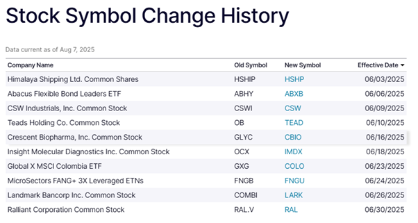

# Fuzzy Filters on OHLC Data

> **Note**: This tutorial is part of a beta release of software that is not yet publicly available. Please contact KX for access.

[Fuzzy Filters](https://docs.kx.com/public-preview/kdb-x/Reference/fuzzy-index-parameters.htm) enable a user to retrieve records from their data that have slight variations to the specified query term and filters.
This is useful for queries or data that may contain typos or misspellings, and would normally result in no relevant search results, or incorrect data being retrieved.   

This tutorial walks through two examples of where it may be useful to introduce Fuzzy Filters, especially for large datasets. 

## 1. Prerequisites

1. Requires KDB-X to be installed, you can sign up at https://kdb-x.kx.com/sign-in. View the [KDB-X Docs](https://docs.kx.com/public-preview/kdb-x/Get_Started/kdb-x-install.htm) for full details on installing KDB-X.
2. Ensure you have the necessary dataset [OHLC.csv](src/OHLC.csv)

## 2. Loading and Preparing the Data

Launch a q session by running `q`:
```
Welcome to KDB-X Community Edition!
For Community support, please visit https://kx.com/slack
Tutorials can be found at https://github.com/KxSystems/tutorials
Ready to go beyond the Community Edition? Email preview@kx.com
q)
```

Then load the AI initialization script:
```q
q) \l ai-libs/init.q
```

Load the dataset (`OHLC.csv`) into a table:

```q
q) ohlc:("DS*FJFFF";enlist ",") 0: `:src/OHLC.csv
```

In the above:
- 0: is used to read the csv file
- The schema `"DS*FJFFF"` specifies the datatypes for each column
- The `","` ensures the CSV is parsed using commas as delimiters.

Now the dataset has been loaded, we can inspect the table using `first` to see what the first row of the table looks like:
```q
q) first ohlc

date      | 2025.02.12
sym       | `ADD
company   | "Color Star Technology Co Ltd"
close     | 1.23
volume    | 495439
open      | 1.24
high      | 1.28
low       | 1.12
```


The table above is an Open High Low Close (OHLC) table, which provides information on a given stock including the first price (open), the last price (close), the maximum price (high) and the minimum price (low) per day. 

## 3. Example: Using Fuzzy Filters for International Spelling Differences
In the above, we can see that one of the compannies in the data is called Color Star Technology Co Ltd.
"Color" is the US English spelling of the word. 

If someone was to search for this company using the UK English spelling "Colour", their search would not return the correct results:
```q
q) select from ohlc where company like "Colour Star Technology Co Ltd"

date sym company close volume open high low
-------------------------------------------
```

We can use Fuzzy Filters to find the correct data even without knowing which way Color is spelt in the company field in the OHLC table.   
  
```q
q) comps:exec distinct company from ohlc;

```
In the above code, we extract a distinct list of company names from the table.
Then we use the `.ai.fuzzy.dist` function to return a measure of how different the companies in the list are from the one in our query. 


```q
q) .ai.fuzzy.dist[comps;"Colour Star Technology Co Ltd";`levenshtein]

1 26 24 27 24 26 20 27f
```

In the above, comps is the distinct list of companies from the table.
"Colour Star Technology Co Ltd" is the string we are matching against.
`levenshtein is the distance type, which must be one of:

```q
q) .ai.fuzzy.utils.fuzzyDistances

`levenshtein`levenshteinNorm`indel`hamming`jaro`jaroWinkler`lcs`damerau`osa`prefix`postfix
```

For simplicity, we’re going to use Levenshtein distance, which gives a number that represents how many single-character changes are needed to change one string into the other. The bigger the number (“the higher the difference”), the greater the difference between the two. 

```q
q) res:.ai.fuzzy.search[comps;"Colour Star Technology Co Ltd";1;`levenshtein]
q) select from ohlc where res like raze res[2]
```

## 4. Example: Using Fuzzy Filters after a Stock Market Symbol Change 

In this example, we have received data on a daily basis populating our OHLC table and we want to query that data.
```q
q) select count distinct date from ohlc

date
----
124
```

The above select statement tells us that we have 124 distinct dates in our table, which is about 6 months of daily data, and if we want to query a specific symbol, e.g. `HSHP we would expect to get 124 entries returned.

```q
q) count select from ohlc where sym=`HSHP

47
```
However, there are only 47 records for this symbol, because on June 3rd, 2025 the symbol for Himalaya Shipping Ltd changed:



Source: https://www.nasdaq.com/market-activity/stocks/symbol-change-history

Now that we know the symbol has changed, we could use Fuzzy Filtering to find all of the data for the Himalaya Shipping Ltd without needing to know what the previous symbol was. 

First, we can use Fuzzy Distance function to find if there are any very similar symbols in the data:
```q
q) syms:exec distinct sym from ohlc;
q) .ai.fuzzy.dist[syms;`HSHP;`levenshtein]

4 4 4 3 1 4 4 4 0f
```

In the above, syms is the list of the items to search, "HSHP" is the pattern to search for, and again we are using Levenshtein distance.

The result tells us that there is one symbol that takes 0 changes to match with HSHP, one symbol that takes one single-character change to match, and the rest all take 3-4 changes.

The match with 0 distance will be HSHP itself, but let's look at the two symbols with the smallest distance:

```q
q) res:.ai.fuzzy.search[syms;`HSHP;2;`levenshtein]
q) res

0    1
8    4
HSHP HSHIP
```
Now we can search for data for both these symbols:
```q
q) select from ohlc where sym in res[2]

date       sym   company                 close volume open high   low
------------------------------------------------------------------------
2025.02.12 HSHIP "Himalaya Shipping Ltd" 4.83  205194 4.75 4.85   4.738
2025.02.13 HSHIP "Himalaya Shipping Ltd" 4.94  89261  4.87 4.98   4.8501
2025.02.14 HSHIP "Himalaya Shipping Ltd" 4.99  87297  4.99 5.055  4.95
2025.02.18 HSHIP "Himalaya Shipping Ltd" 5.23  230474 5.13 5.3    5.13
2025.02.19 HSHIP "Himalaya Shipping Ltd" 5.27  279502 5.3  5.37   5.14
2025.02.20 HSHIP "Himalaya Shipping Ltd" 5.5   170577 5.45 5.68   5.44
2025.02.21 HSHIP "Himalaya Shipping Ltd" 5.34  239442 5.6  5.6    5.32
2025.02.24 HSHIP "Himalaya Shipping Ltd" 5.18  278755 5.2  5.345  5.11
2025.02.25 HSHIP "Himalaya Shipping Ltd" 5.42  258100 5.42 5.59   5.34
2025.02.26 HSHIP "Himalaya Shipping Ltd" 5.68  198694 5.58 5.75   5.58
2025.02.27 HSHIP "Himalaya Shipping Ltd" 5.31  198515 5.4  5.45   5.28
2025.02.28 HSHIP "Himalaya Shipping Ltd" 5.45  174216 5.48 5.54   5.36
2025.03.03 HSHIP "Himalaya Shipping Ltd" 5.34  309573 5.55 5.58   5.335
2025.03.04 HSHIP "Himalaya Shipping Ltd" 5.25  147806 5.13 5.31   5.04
2025.03.05 HSHIP "Himalaya Shipping Ltd" 5.44  216607 5.67 5.67   5.41
2025.03.06 HSHIP "Himalaya Shipping Ltd" 5.52  189787 5.51 5.61   5.46
2025.03.07 HSHIP "Himalaya Shipping Ltd" 5.65  202489 5.71 5.75   5.625
..
```

Now to check that the data returned from those two symbols is all of the data that we wanted to retrieve for the full 6 months:
```q
q) count select from ohlc where sym in res[2]

124
```

## Conclusion
Querying data using Fuzzy Filters has many uses from spotting typos and misspellings, to international spelling variations to improve recall and retreival of data. It works by checking the "distance" between search terms, and the user can determine both the distance metric, and how far apart the returned values can be. Each distance metric will have its own algorithm for checking distance and method of determining the edit distance, and you can determine which to use to depending on the level of accuracy and relevance you need for a specific use case. To learn more about Fuzzy Filters and other Vector Searches, visit [KDB-X Docs AI Libraries Overiew](https://docs.kx.com/public-preview/kdb-x/Reference/ai-libraries-overview.htm).
